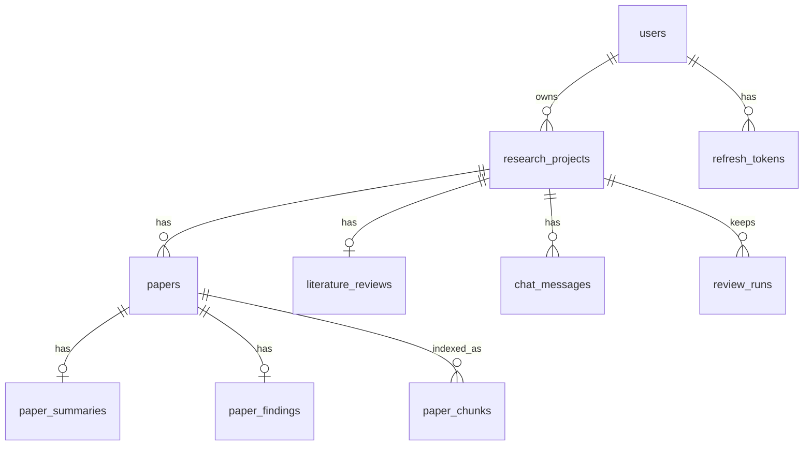

# ResearchGPT — Architecture

> Describes the code **as of Phase 4 of [fix-plan.md](fix-plan.md) (2026-09-19)**.
> The earlier LangGraph and server-side Gemini design is described in
> [decisions.md](decisions.md), in the entries marked *Superseded*.

---

## 1. What the system does

1. A user signs up and saves their **own LLM key** — Google Gemini, Anthropic Claude or OpenAI. It stays in their browser's localStorage and is sent only to that provider.
2. They create a project with a research topic and click **Run analysis**.
3. **Browser:** it plans search queries, then screens the candidates the server found for relevance and picks the best ones.
4. **Server:** a collection job searches five academic APIs, downloads the chosen open-access PDFs through an SSRF guard, extracts their text, and stores it.
5. **Browser:** the page analyses the papers with the user's key, in a map-reduce:
   - **map:** one structured extraction per paper (the PDF itself where the model reads PDFs)
   - **reduce:** one cited literature review
   - then a **citation check**: every cited sentence is checked against what was extracted from the papers it cites

   Each result is saved as soon as it's ready.
6. The user reads the review — with numbered references, flagged citations, Markdown/BibTeX/RIS export and the history of earlier runs — and chats with the papers. Chat also runs in the browser, and only finished exchanges are saved.

```
┌──────────────────── Browser (React + TS) ─────────────────────┐
│ localStorage: researchgpt-llm (key, provider, models, prices) │      generativelanguage.googleapis.com
│ llm/ (gemini · anthropic · openai, generateJSON, retry, meter)│──▶  api.anthropic.com
│ research/ (screening, runAnalysis, verify, exports, chat)     │      api.openai.com
│ TanStack Query ── axios (X-Requested-With) ──┐                │
└──────────────────────────────────────────────┼────────────────┘
                     httpOnly cookies, /api/*  ▼
┌──────────────── FastAPI (single codebase, N instances) ───────────────┐
│ routes: auth · projects · papers · reviews · chat                     │
│ services: collection (job + heartbeat) · search (5 sources, cached)   │
│           · analysis (store results) · passages (full-text retrieval) │
│           · manual_papers (add/upload/remove) · session (cookies)     │
│ utils: safe_http (SSRF-safe fetch) · pdf_text (pypdf)                 │
└──────────────┬─────────────────────────────────────┬──────────────────┘
               ▼                                     ▼
          PostgreSQL          Semantic Scholar · OpenAlex · arXiv · Europe PMC · Unpaywall
```

**The server never calls an LLM.** CI fails if an LLM SDK or provider API host
appears in the backend, and the API refuses to start in production if an LLM key
is configured.

---

## 2. Repository layout

```
ResearchGPT/
├── DEPLOY.md, README.md
├── eval/                     # fixed topics + how to compare prompt versions
├── docker-compose.yml        # db → migrate (alembic) → backend (healthy) → frontend
├── docker-compose.test.yml   # throwaway Postgres for tests (127.0.0.1:55432)
├── .github/workflows/ci.yml  # backend (lint, tests, alembic check, no-LLM check), frontend, e2e
├── backend/
│   ├── main.py               # app, middleware (request id, security headers, CSRF), health
│   ├── alembic/versions/     # 0001 … 0012
│   ├── scripts/e2e_server.py # e2e API: fresh DB, stubbed paper search and DOI lookup
│   ├── scripts/eval_reviews.py  # read-only: compares runs per prompt version
│   ├── tests/                # pytest (see §7)
│   └── app/
│       ├── api/deps.py       # get_owned_project / load_owned_project (+ stale-job expiry)
│       ├── api/routes/       # auth, projects, papers, reviews, chat
│       ├── core/             # config, security, logging (+Sentry), rate_limit
│       ├── services/         # collection, analysis, manual_papers, passages,
│       │                     #   review_metrics, session, search/ (5 sources, cache)
│       ├── utils/            # safe_http, pdf_text
│       ├── models/, schemas/, db/
└── frontend/
    ├── nginx.conf.template   # security headers + /api proxy to ${API_UPSTREAM}
    ├── public/_headers       # same headers for static hosts (a test keeps them identical)
    ├── e2e/                  # Playwright: smoke, byok, research, a11y (axe), helpers
    └── src/
        ├── llm/              # types, providers/{gemini,anthropic,openai}, generate,
        │                     #   retry, schema, sse, meter, pricing
        ├── research/         # screening, prompts, runAnalysis, verify, exports,
        │                     #   useResearchRun, pdf, chat, useChat
        ├── services/         # api (axios + refresh), queries (TanStack), types
        ├── store/            # authStore (user only), llmSettings (the key)
        ├── components/       # Markdown (sanitised), Tabs (WAI-ARIA), layout
        └── pages/            # Dashboard, NewProject, Project, Review, Chat, Settings, Privacy, Login, Register
```

---

## 3. Backend

### 3.1 Request pipeline — [main.py](../backend/main.py)

Middleware, from the outside in:

- **CORS:** `CORS_ORIGINS`.
- **GZip.**
- **Security headers:** `nosniff`, `no-referrer`, a `default-src 'none'` CSP and `Cache-Control: no-store` on every `/api` response.
- **CSRF:** `POST`, `PUT`, `PATCH` and `DELETE` under `/api` need an `X-Requested-With` header, or get a 403.
- **Request ID:** every log line of a request and its response carry an `X-Request-ID`. A well-formed incoming ID is reused.

**Startup:**
- Fails collection jobs whose heartbeat went stale.
- Creates `logs/` only when `LOG_TO_FILE` is on.

**Health and docs:**
- `/health` does a `SELECT 1` and returns 503 when the database is down.
- `/docs`, `/redoc` and `/openapi.json` exist only in development.

### 3.2 Configuration — [core/config.py](../backend/app/core/config.py)

Settings are read from environment variables and `.env`; environment variables win. Outside `APP_ENV=development` the API **refuses to start** when:
- `SECRET_KEY` is missing, shorter than 32 characters, or a known placeholder
- `COOKIE_SECURE` is false
- any of `GEMINI_API_KEY`, `GOOGLE_API_KEY`, `OPENAI_API_KEY` or `ANTHROPIC_API_KEY` is set

Other settings:

| Group | Settings |
|---|---|
| Sessions | `ACCESS_TOKEN_EXPIRE_MINUTES` (15), `REFRESH_TOKEN_EXPIRE_DAYS` (7), `COOKIE_SECURE`, `BCRYPT_ROUNDS` (12) |
| Abuse limits | `RATE_LIMIT_ENABLED`, `RATE_LIMIT_STORAGE_URI`, `MAX_PROJECTS_PER_DAY` (20) |
| Collection | `MAX_PDF_SIZE_MB` (25) |
| Logging | `LOG_FORMAT` (`text`/`json`), `LOG_TO_FILE`, `SQL_ECHO`, `SENTRY_DSN`, `SENTRY_TRACES_SAMPLE_RATE` |

### 3.3 Data model — [models/models.py](../backend/app/models/models.py)



General rules:
- All foreign keys are `ON DELETE CASCADE`, and the ORM relationships use `passive_deletes`, so deleting a user removes everything they own.
- All timestamps are `TIMESTAMPTZ`.

| Table | Notes |
|---|---|
| `research_projects` | `status`: `pending → collecting → collected → completed`, or `failed`. Also `progress`, `current_step`, `heartbeat_at`, `error` (a message safe to show users), `started_at` and `finished_at`. |
| `papers` | Metadata plus `full_text`, and the screening result (`relevance_score`, `relevance_reason`). The text is *deferred* (loaded only with `undefer`); listings use the computed `has_full_text` flag instead. `doi` and `pdf_url` are indexed, which is how text extracted once is reused. |
| `paper_summaries`, `paper_findings` | One row each per paper, written by the browser's extraction. `raw_json` keeps the full extraction, including `metrics` and `key_quotes`. |
| `literature_reviews` | Introduction, body, discussion, conclusion, trends, gaps and comparison, plus `citation_checks` (per-claim verdicts) and `run_meta` (prompt version, provider, models, token usage, duration). One row per project. |
| `review_runs` | The last 10 saved reviews of a project, with their sections, checks, run metadata and paper titles: history and run comparison. |
| `paper_chunks` | ~1,500-character passages of each paper's text with a generated `tsvector` and a GIN index, built lazily the first time a project is searched. Used by chat retrieval. |
| `search_cache` | Search results per source and query for 7 days, so re-running a topic doesn't hammer the APIs. |
| `chat_messages` | Question and answer pairs. `citations = {"papers": [{paper_id, title}]}`. Ordered by `(created_at, id)`. |
| `refresh_tokens` | Only the SHA-256 hash of each token is stored, with `expires_at` and `revoked_at`. |

### 3.4 API — [api/routes/](../backend/app/api/routes/) (prefix `/api`)

Every project-scoped route goes through `get_owned_project`, which returns 404 both when the project doesn't exist and when it belongs to someone else. That dependency is also where a dead collection job is marked failed.

| Route | Purpose |
|---|---|
| `POST /auth/register` (5/hour per IP), `POST /auth/login` (10/min per IP) | Login sets the session cookies and returns the user; no token appears in the body. |
| `POST /auth/refresh`, `POST /auth/logout`, `GET /auth/me`, `DELETE /auth/me` | Refresh rotates the token. Logout revokes the session. Account deletion requires the password. |
| `GET/POST /projects`, `GET/DELETE /projects/{id}` | Creating is limited to 20 projects per 24 hours per user. |
| `POST /projects/{id}/search`, `POST /projects/{id}/snowball` | Search every source (or follow citations of the best matches) and return candidates for the browser to screen. |
| `POST /projects/{id}/collect` | Starts the collection job for the chosen candidates. Returns 409 if it's already running, and 429 if another of the user's projects is collecting. |
| `POST /projects/{id}/papers`, `POST .../papers/upload`, `DELETE .../papers/{paper_id}` | Add a paper by DOI or arXiv id, add one from an uploaded PDF (only its text is kept), or remove one. Changing the papers puts the project back to `collected`, so the review gets rewritten. |
| `PUT /projects/{id}/papers/{paper_id}/extraction` | Saves one paper's extraction. Returns 409 unless the project is collected or completed. |
| `PUT /projects/{id}/analysis` | Saves the review and marks the project completed. |
| `GET /papers/{id}`, `/texts`, `/summaries`, `/findings` | `/texts` includes the full text, for building prompts. |
| `GET /papers/{id}/{paper_id}/pdf` | Streams the paper's PDF through the SSRF guard so the browser can send it to a model that reads PDFs. Nothing is stored. |
| `GET /papers/{id}/passages?q=` | Full-text search over the project's papers; chat sends the best passages to the model. |
| `GET /reviews/{id}`, `/markdown`, `/versions` | `/versions` lists earlier runs with their quality metrics. |
| `GET/DELETE /chat/history/{id}`, `POST /chat/{id}/messages` | The server keeps only citations of the project's own papers. |

### 3.5 Collection job — [services/collection_service.py](../backend/app/services/collection_service.py)

```
search (PaperSearchAgent, 3 sources concurrently, dedup by title)
  → for each paper with a pdf_url (4 at a time):
       fetch_public (utils/safe_http): http(s) only, every resolved address and
         every redirect hop must be public, ≤3 redirects, size cap while streaming
       extract_pdf_text (utils/pdf_text): pypdf in a thread, ≤60 pages, ≤150k chars
  → replace_papers (also deletes the now-stale review) → status 'collected'
```

**Running and monitoring:**
- The job runs as a FastAPI `BackgroundTask` and writes a **heartbeat** every 15 seconds.
- `is_active` means `collecting` with a heartbeat less than 90 seconds old.
- A stale job is marked failed in two places: at startup (`fail_stale_collections`) and lazily whenever the project is read. This is safe with several instances.

**Failures:**
- Expected failures (`CollectionError`) store their message for the user.
- Anything unexpected is logged with its stack trace and stored as a generic message.

**Logging:** every log line carries the `project_id`.

### 3.6 Sessions — [services/session_service.py](../backend/app/services/session_service.py)

| Cookie | Content | Path | Lifetime |
|---|---|---|---|
| `rg_access` | JWT (PyJWT, HS256) | `/api` | 15 min |
| `rg_refresh` | opaque token | `/api/auth` | 7 days |

- Both cookies are httpOnly and SameSite=Lax, and Secure when `COOKIE_SECURE` is on.
- **Rotation:** refreshing revokes the old token and issues a new one.
- **Reuse detection:** presenting an already-revoked token revokes every session of that user. That revocation is committed before the 401 is raised, because `get_db` would otherwise roll it back.
- **API clients:** a `Bearer` token in the `Authorization` header is still accepted, and it takes precedence over the cookie.
- **Passwords:** bcrypt through pwdlib. Existing passlib hashes still verify.

### 3.7 Transactions — [db/session.py](../backend/app/db/session.py)

`get_db` owns the commit. Routes and services only add and flush. Background code opens its own `AsyncSessionLocal()` and commits itself.

---

## 4. Frontend

### 4.1 LLM layer — [src/llm/](../frontend/src/llm/)

**Provider interface** (`types.ts`): `LLMProvider` with `listModels`, `complete` and `stream`, plus the host the key goes to, whether the provider reads PDFs, and its default fast and strong models. Errors are typed: `InvalidKeyError`, `RateLimitError` (which may carry a retry delay), and `LLMError` (which can be marked retryable).

| Adapter | How it calls the provider |
|---|---|
| `providers/gemini.ts` | `fetch` against the REST API, key in `x-goog-api-key` and never in a URL; `responseSchema` for JSON; SSE from `streamGenerateContent?alt=sse`, dropping "thought" parts. |
| `providers/anthropic.ts` | The official `@anthropic-ai/sdk`, loaded on demand so other users never download it, with `dangerouslyAllowBrowser` (the key is the user's own). Structured output through `output_config.format`, PDFs as document blocks, Opus 5 opted into server-side refusal fallbacks, SDK retries off because `generate.ts` retries. |
| `providers/openai.ts` | `fetch` against Chat Completions: `json_schema` output, PDFs as file parts, SSE streaming, no `temperature` for reasoning models. |

All three map finish reasons to `stop`, `length` or `blocked`, and errors to the types above.

**Tokens and cost:** `meter.ts` wraps a provider so a run counts calls and tokens per model (retries included); `pricing.ts` turns that into money, with list prices the user can override in Settings and an estimate shown before each run.

**`generateJSON`** (`generate.ts`) validates against a Zod schema, which `schema.ts` converts for Gemini. It handles bad replies like this:

| Problem | Response |
|---|---|
| Reply doesn't match the schema | one repair round, showing the model the validation error |
| Reply cut off by the token limit | one retry with twice the budget |
| Safety block | fail immediately |
| Rate limit or transient error | backoff with jitter (`retry.ts`) |

### 4.2 Research runs — [src/research/](../frontend/src/research/)

- **`prompts.ts`:**
  - Each paper goes inside `<paper id="P…">`, with the instruction that it's data, never instructions.
  - Full text is trimmed to 60k characters.
  - `ExtractionSchema` and `ReviewSchema` define the outputs.
  - `sanitizeReview` removes citations of unknown papers.
- **`screening.ts`:** plans search queries from the topic, rates each candidate's relevance (0–10, in batches) and picks the papers to collect; `snowballSeeds` chooses which best matches to follow citations from.
- **`runAnalysis.ts`:** the orchestration, kept independent of React.
  - Processes only papers without a saved extraction, three at a time, saving each one.
  - Sends the PDF itself where the provider reads PDFs, and falls back to the extracted text.
  - Skips a paper the model can't handle.
  - Stops on a rejected key, an exhausted rate limit, or a failure of our own API.
  - Then writes the review with the stronger model, and runs the citation check.
  - Saves the review with the run's prompt version, models and token usage.
- **`verify.ts`:** takes the review's cited sentences (up to 40) and checks them in batches of 10 against the cited papers' extracted findings: `supported`, `partly` or `unsupported`. Best effort — a failure here never costs the user the review.
- **`exports.ts`:** numbers the citations in order of first use, builds the reference list, and writes Markdown, BibTeX and RIS in the browser.
- **`useResearchRun.ts`:**
  - `start()` means collect, poll until done, then analyse. `resume()` means analyse only.
  - Warns before the tab is closed mid-analysis, and aborts when you navigate away.
- **`chat.ts` / `useChat.ts`:** the context is each paper's findings (or its abstract), the passages of the full texts that match the question (from the server's full-text search) and the last 8 messages. The answer streams in and is saved only once complete.

### 4.3 Server state and sessions

- **Server state:** `services/queries.ts` holds all the TanStack Query hooks. A project polls itself every 2 seconds while `collecting`, and pauses while the tab is hidden.
- **API client** (`services/api.ts`):
  - Sends `X-Requested-With` on every request.
  - On a 401 it makes one refresh attempt, shared by concurrent requests, and retries.
  - If that fails, it signs out.
- **Stores:**
  - `authStore` keeps only the user object (nothing secret).
  - `llmSettings` holds the provider, the key, a "tested" flag, the model choices, whether to send PDFs, and any price overrides. It's persisted separately from auth, so signing out keeps it. Switching provider clears the key, which belongs to one provider.
- **Rendering:** `components/Markdown.jsx` is the only way model output gets rendered: react-markdown plus remark-gfm plus rehype-sanitize, with no raw HTML.

### 4.4 Security headers

These live in `nginx.conf.template`, with a copy in `public/_headers`:
- CSP: `script-src 'self'`, and `connect-src 'self'` plus the three provider hosts (`generativelanguage.googleapis.com`, `api.anthropic.com`, `api.openai.com`). A test ties that list to the providers the app ships, so adding one without updating the CSP fails.
- HSTS, `X-Frame-Options: DENY`, `nosniff`, `no-referrer`, COOP, Permissions-Policy.
- The font is self-hosted, so no third-party hosts are needed.

---

## 5. Runtime and deployment

See [DEPLOY.md](../DEPLOY.md).

**Images:**
- **Backend:** multi-stage build that runs as a non-root user and logs JSON. Migrations run as a separate release step.
- **Frontend:** nginx, pointed at the API through `API_UPSTREAM`.

**Compose:** `db` → `migrate` → `backend` (health-checked) → `frontend`.

---

## 6. External services

| Service | Called by | Auth |
|---|---|---|
| Gemini, Claude or OpenAI | the browser | the user's key |
| Semantic Scholar, OpenAlex, arXiv, Europe PMC | the server's search and collection | keyless (optional keys raise the limits) |
| Unpaywall, OpenAlex (citations, DOI lookup) | the server | a contact email |

---

## 7. Tests

| Suite | Count | What it covers |
|---|---|---|
| **pytest** (`backend/tests`) | 186 | auth and sessions, ownership (IDOR) on every route, validation, search and deduplication, collection job, SSRF guard, PDF extraction, analysis storage, citation checks and run metadata, passage retrieval, manual papers, review versions, chat, rate limits and quotas, config guards, migrations, observability |
| **Vitest** (`frontend/src/**/*.test.*`) | 90 | all three provider adapters (request shape, streaming, error mapping), generateJSON repair and truncation, retry, token metering, pricing, runAnalysis (resume, skip, fatal errors, concurrency, cancel), screening, citation checks, exports, prompts and citations, chat context, settings store, Markdown sanitisation, polling rules, header parity |
| **Playwright** (`frontend/e2e`) | 28 | real Chrome, real API, throwaway DB, every provider stubbed at the network layer, paper search stubbed on the e2e server: sign-up with a key, a full run with each provider, rate-limit resume, screening, snowballing, PDF input, review tabs and exports, run history, manual papers, chat with retrieval, sessions, deletion, accessibility (axe, WCAG 2.1 A and AA), and **the key never appearing in any `/api` request** |

**Opt-in live check:** `GEMINI_LIVE_KEY=… npx vitest run gemini.live` calls the real Gemini API.
