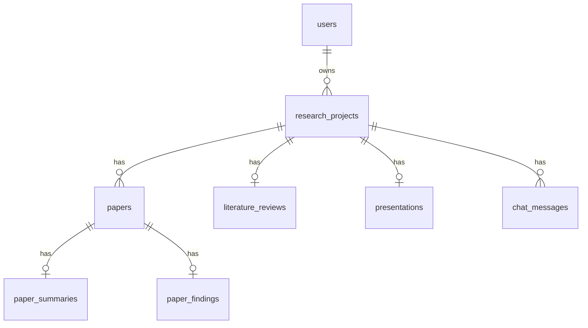
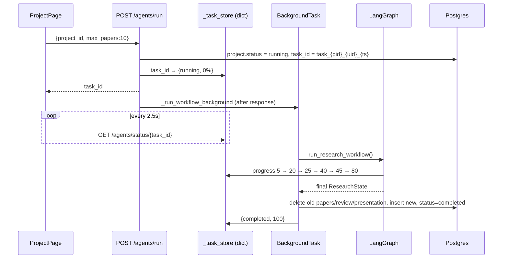

# ResearchGPT — Architecture

> Describes the code **as it exists on `main` (commit `1446fba`)**, not the README.
> Where the README and the code disagree, this document follows the code. See
> [improvements.md](improvements.md#6-documentation-drift) for the list of mismatches.

---

## 1. What the system does

A user creates a **research project** with a topic. The backend runs a 3-step
LangGraph pipeline:

1. search three academic APIs for papers
2. download any open-access PDFs
3. send the paper abstracts to Gemini in **one** structured-output call

The Gemini output is stored as a **literature review**, which includes trends and
research gaps. The user can then **chat** about the papers. Each chat question is
answered by Gemini, with the stored abstracts pasted into the prompt as context.

```
┌──────────────────────────┐        ┌────────────────────────────────────────────┐
│  React SPA (Vite)        │  /api  │  FastAPI (uvicorn, single process)         │
│  - Zustand auth store    ├───────►│  ├─ routes: auth, projects, agents,        │
│  - axios + JWT header    │  JSON  │  │          papers, reviews, chat          │
│  - 2.5s status polling   │◄───────┤  ├─ BackgroundTasks ─► LangGraph workflow  │
└──────────────────────────┘        │  │     ├─ PaperSearchAgent ──► S2/arXiv/PubMed
   dev: Vite proxy                  │  │     ├─ PaperCollectionAgent ─► PDFs on disk
   prod: nginx proxy                │  │     └─ ComprehensiveAnalysisAgent ─► Gemini
                                    │  ├─ in-memory _task_store (progress)       │
                                    │  └─ async SQLAlchemy ──► PostgreSQL        │
                                    └────────────────────────────────────────────┘
```

---

## 2. Repository layout (actual)

```
ResearchGPT/
├── docker-compose.yml          # postgres, redis (unused), backend, frontend
├── backend/
│   ├── main.py                 # FastAPI app, middleware, router mounting, lifespan
│   ├── alembic/                # single migration: versions/0001_initial.py
│   └── app/
│       ├── core/
│       │   ├── config.py       # pydantic-settings Settings (env / .env)
│       │   ├── security.py     # bcrypt hashing, JWT encode/decode, get_current_user_id
│       │   ├── logging.py      # loguru: stdout + daily-rotated file
│       │   └── task_store.py   # module-level dict used as a task-progress store
│       ├── db/                 # DeclarativeBase, async engine + get_db dependency
│       ├── models/models.py    # 8 ORM tables
│       ├── schemas/schemas.py  # Pydantic v2 request/response models
│       ├── agents/
│       │   ├── workflow.py     # LangGraph StateGraph (3 nodes) + runner
│       │   ├── search/         # Agent 1 — Semantic Scholar, arXiv, PubMed
│       │   ├── collection/     # Agent 2 — PDF download
│       │   └── comprehensive/  # Agent 3 — single batched Gemini call
│       ├── api/routes/         # auth, projects, agents, papers, reviews, chat
│       ├── utils/gemini_client.py  # google-genai client singleton + RateLimitError
│       └── services/           # empty
└── frontend/
    ├── nginx.conf              # SPA fallback + /api reverse proxy to backend:8000
    ├── vite.config.js          # dev server :5173, proxies /api → :8000
    └── src/
        ├── App.jsx             # routes + ProtectedRoute
        ├── services/api.js     # axios instance, JWT interceptor, API modules
        ├── store/authStore.js  # zustand + persist (localStorage)
        ├── components/layout/AppLayout.jsx
        ├── pages/              # Login, Register, Dashboard, NewProject, Project, Chat, Review
        ├── hooks/, utils/      # empty
        └── styles/globals.css  # Tailwind component classes (btn-*, card, badge-*)
```

---

## 3. Backend

### 3.1 Application bootstrap — [main.py](../backend/main.py)

- `setup_logging()` runs at import time.
- `lifespan` creates `PDF_STORAGE_DIR`, `CHROMA_PERSIST_DIR`, `./storage/presentations`
  and `./logs` on startup, and disposes the engine on shutdown. The Chroma and
  presentation directories are left over from the older architecture; nothing writes to them now.
- Middleware order: CORS, then GZip (min 1000 bytes).
- All routers are mounted under `settings.API_V1_PREFIX`, which defaults to **`/api`** (not `/api/v1`).
- The schema is managed **only by Alembic**. The app never calls `metadata.create_all`.

### 3.2 Configuration — [core/config.py](../backend/app/core/config.py)

`Settings(BaseSettings)` reads from the environment and from `.env`. Unknown variables are ignored.

| Group | Keys | Actually used? |
|---|---|---|
| App | `APP_NAME`, `APP_ENV`, `DEBUG`, `API_V1_PREFIX` | yes (`DEBUG` also turns on SQL echo) |
| Security | `SECRET_KEY` (has an insecure default), `ACCESS_TOKEN_EXPIRE_MINUTES`, `ALGORITHM` | yes |
| DB | `DATABASE_URL` (asyncpg), `SYNC_DATABASE_URL` (psycopg3, used by Alembic) | yes |
| Gemini | `GEMINI_API_KEY`, `GEMINI_MODEL` (`gemini-2.5-flash`) | yes |
| Storage | `PDF_STORAGE_DIR`, `MAX_PDF_SIZE_MB` | yes |
| CORS | `CORS_ORIGINS` (JSON list or comma-separated) | yes |
| Limits | `MAX_PAPERS_PER_SEARCH`, `MAX_PAPERS_TO_DOWNLOAD` | **no** (declared, never read) |
| Chroma | `CHROMA_PERSIST_DIR`, `CHROMA_COLLECTION_NAME` | only for `mkdir` |
| Redis / S3 / Pinecone | `REDIS_URL`, `AWS_*`, `USE_S3`, `PINECONE_*`, `USE_PINECONE` | **no** (placeholders) |

A validator rewrites a `SYNC_DATABASE_URL` that starts with `postgresql://` to
`postgresql+psycopg://`, so Alembic always uses the psycopg3 driver.

### 3.3 Database layer — [db/session.py](../backend/app/db/session.py)

- There is one async engine (`create_async_engine`) with `pool_pre_ping=True`.
- If the URL contains `neon.tech`, `supabase` or `sslmode=require`, the query string is
  removed and `ssl="require"` is passed through `connect_args`, because asyncpg rejects `sslmode`.
- `get_db()` yields an `AsyncSession`. It commits on success and rolls back on exception.
  Several routes also call `db.commit()` themselves (see decisions.md D-12).
- The background worker opens its own `AsyncSessionLocal()`, because it runs after the request's session has closed.

### 3.4 Data model — [models/models.py](../backend/app/models/models.py)



| Table | Written by | Notes |
|---|---|---|
| `users` | `/auth/register` | email + username unique |
| `research_projects` | `/projects`, agents worker | `status` is a plain string: `pending / running / completed / failed`; `task_id` links to the in-memory store |
| `papers` | agents worker | `authors` is a JSON-encoded list stored in TEXT; `status` is always saved as `"processed"` |
| `paper_summaries` | **nothing** | the worker only writes a row if `paper["summary"]` exists, and no current agent sets it |
| `paper_findings` | **nothing** | same: the `findings` key is never populated |
| `literature_reviews` | agents worker | intro / body / discussion / conclusion from Gemini, plus `trends` and `gaps` |
| `presentations` | **nothing** | the PPTX agent was removed; `state["presentation"]` is always `{}` |
| `chat_messages` | `/chat/query` | `citations` JSON column is never filled |

Project children use ORM-level `cascade="all, delete-orphan"`. The foreign keys
themselves have no `ON DELETE CASCADE`, and there are no indexes on the `project_id` / `paper_id` FK columns.

### 3.5 API surface — [api/routes/](../backend/app/api/routes/)

All paths are prefixed with `/api`.

| Method | Path | Auth | Ownership check | Purpose |
|---|---|---|---|---|
| POST | `/auth/register` | — | — | create user |
| POST | `/auth/login` | — | — | returns JWT + `user_id`, `username` |
| GET | `/auth/me` | JWT | self | current user |
| POST | `/projects` | JWT | sets owner | create project |
| GET | `/projects` | JWT | ✅ filtered by user | list |
| GET | `/projects/{id}` | JWT | ✅ | get |
| DELETE | `/projects/{id}` | JWT | ✅ | delete (cascades) |
| POST | `/agents/run` | JWT | ✅ | start pipeline (returns `task_id`) |
| GET | `/agents/status/{task_id}` | **none** | ❌ | poll progress from `_task_store` |
| GET | `/papers/{project_id}` | JWT | ❌ | list papers |
| GET | `/papers/{project_id}/summaries` | JWT | ❌ | always empty (see 3.4) |
| GET | `/papers/{project_id}/findings` | JWT | ❌ | always empty |
| GET | `/reviews/{project_id}` | JWT | ❌ | literature review |
| GET | `/reviews/{project_id}/markdown` | JWT | ❌ | review rendered as Markdown text |
| GET | `/chat/history/{project_id}` | JWT | ❌ | messages |
| DELETE | `/chat/history/{project_id}` | JWT | ❌ | bulk delete |
| POST | `/chat/query` | JWT | ❌ | ask a question → Gemini |
| GET | `/`, `/health` | — | — | liveness |

The ❌ rows are a real authorization gap. Details are in [improvements.md](improvements.md#1-security).

### 3.6 Authentication — [core/security.py](../backend/app/core/security.py)

- Passwords are hashed with passlib `CryptContext(bcrypt)`. `bcrypt==3.2.0` is pinned for passlib compatibility.
- Tokens are JWT HS256 (python-jose). `sub` holds the user id as a string, and the default expiry is 60 min. There are no refresh tokens.
- The `get_current_user_id` dependency returns only the `int` id. It does not load the user,
  so a deactivated user's token keeps working until it expires.
- On the frontend, the token is saved in `localStorage` through zustand `persist`.
  An axios interceptor attaches it and forces a logout on any 401.

### 3.7 The research pipeline

#### Lifecycle of one run



#### Graph — [agents/workflow.py](../backend/app/agents/workflow.py)

The graph is linear: `step_paper_search → step_paper_collection → step_comprehensive_analysis → END`.
Node names have a `step_` prefix because LangGraph 0.2 raises an error when a node name matches a state key.

`ResearchState` (TypedDict) holds `topic, project_id, max_papers, task_id, papers,
comparison, trends, gaps, literature_review, presentation, current_agent, progress, errors`.
`presentation` and `errors` are never written. `comparison` is written but never persisted.

Progress is sent to the UI as a side effect: `_update_progress` mutates `_task_store`
directly, because LangGraph state is not visible from outside the running graph.

| Node | Agent | Behaviour | On failure |
|---|---|---|---|
| Paper Search | [search/agent.py](../backend/app/agents/search/agent.py) | Queries Semantic Scholar, arXiv (Atom XML) and PubMed (esearch + efetch) concurrently with `asyncio.gather`. Each source is capped at 10 results and retried 3× with exponential backoff (tenacity). Papers with abstracts under 20 chars are dropped, duplicates are removed by the first 80 chars of the lowercased title, and the list is truncated to `max_papers`. | a failing source is logged and skipped; if the whole node fails, `papers = []` |
| Paper Collection | [collection/agent.py](../backend/app/agents/collection/agent.py) | For each paper with a `pdf_url`, it streams the PDF to `storage/pdfs/{project_id}/{md5(url)[:12]}.pdf`. It stops at `MAX_PDF_SIZE_MB` and deletes the partial file, and skips PDFs that were already downloaded. Downloads run **sequentially**. | a failed paper keeps `pdf_path = None` |
| Comprehensive Analysis | [comprehensive/agent.py](../backend/app/agents/comprehensive/agent.py) | Builds one prompt from **title, year, authors and abstract** of up to 10 papers. It calls Gemini with `response_schema=ComprehensiveAnalysisSchema` (`comparison, trends, gaps, literature_review{introduction, body, discussion, conclusion}`), `max_tokens=8000`, `temperature=0.3`, then slices from `{` to `}` and runs `json.loads`. | `RateLimitError` goes up to the worker and the project is marked FAILED; any other error returns an empty skeleton and the project is still marked COMPLETED |

> **Important:** the downloaded PDFs are **never read**. Analysis and chat use only the abstracts.

#### Gemini client — [utils/gemini_client.py](../backend/app/utils/gemini_client.py)

- A lazily created `google.genai.Client`, used through its async API `client.aio.models.generate_content`.
- `ask_gemini(prompt, max_tokens, response_schema=None)` returns the text. When a
  schema is passed, it sets `response_mime_type="application/json"`.
- A 429 error is recognised by matching the text `"429"` / `"ResourceExhausted"` and
  re-raised as `RateLimitError`. There is no retry, backoff, token accounting or timeout.

#### Persisting results — `_run_workflow_background` in [routes/agents.py](../backend/app/api/routes/agents.py)

After the graph finishes, the worker opens one session and:

1. deletes the project's existing `Paper` rows (their summary and findings rows cascade), `LiteratureReview` and `Presentation`
2. inserts the new papers (title truncated to 999 chars, URLs to 1999)
3. inserts a `LiteratureReview` if Gemini returned one
4. sets `project.status = completed` and commits

If anything raises an exception, the task becomes `failed` and the project is set to `FAILED` in a separate session.

### 3.8 Chat — [routes/chat.py](../backend/app/api/routes/chat.py)

Chat does not use RAG. For each question, the route:

1. saves the user message and commits
2. loads the project's papers and pastes up to 15 `title (year) + abstract` into the prompt
3. asks Gemini (max 2048 tokens) to answer using only that context
4. saves the answer. If Gemini fails, the saved answer is `"Sorry, I encountered an error: {e}"`.
5. returns `{"answer", "sources": []}`

The frontend reads `data.citations` (not `sources`), so citations never render.
Earlier conversation turns are **not** sent to the model, so each question is answered on its own.

### 3.9 Logging — [core/logging.py](../backend/app/core/logging.py)

Loguru writes to stdout at DEBUG or INFO depending on `DEBUG`. It also writes to
`logs/researchgpt_{date}.log`, rotated at midnight, kept for 30 days, and zipped.

---

## 4. Frontend

| Concern | Implementation |
|---|---|
| Build | Vite 5, React 18, Tailwind 3 (custom `brand` orange / `cream` / `espresso` palette, Outfit font) |
| Routing | react-router v6. `/login` and `/register` are public. Everything else sits inside `ProtectedRoute` + `AppLayout` (sidebar) |
| Auth state | zustand `persist` → `localStorage["researchgpt-auth"]` = `{token, user}` |
| HTTP | [services/api.js](../frontend/src/services/api.js): axios with `baseURL: '/api'`. There is one API module per backend router. |
| Pages | **Dashboard** lists and deletes projects · **NewProject** creates one · **Project** runs the pipeline, polls status every 2.5 s, shows the step dots and the paper list · **Chat** shows history, suggestion chips, sends questions and clears history · **Review** has six tabs, a hand-written Markdown renderer (`renderMd`, HTML-escaped) and a `.md` download |
| Notifications | react-hot-toast |
| Icons | lucide-react |

The step indicator on `ProjectPage` still lists the **9 steps of the old pipeline**.
Its `STEPS` array does not contain `"Comprehensive Analysis"`, so the step dots stop moving during the longest step.

---

## 5. Runtime & deployment

| Mode | How it's wired |
|---|---|
| Local dev | `uvicorn main:app --reload` on :8000, `npm run dev` on :5173. The Vite proxy forwards `/api` to :8000, so there is no CORS in the browser. |
| Docker Compose | `db` (postgres:15-alpine, healthcheck) → `backend` (python:3.11-slim; runs `alembic upgrade head`, then uvicorn) → `frontend` (node:18 build, then nginx; serves the SPA and proxies `/api/` to `backend:8000`). `redis` also starts but nothing connects to it. `./backend/storage` and `./backend/logs` are bind-mounted. |
| Hosted DB | Neon or Supabase are supported through the SSL detection in `session.py`. |

**Process model:** one uvicorn process. Pipeline runs are FastAPI `BackgroundTasks`
inside that process, and progress is held in a Python dict. This model only works
with **a single worker**, and all task state is lost on restart. See
[decisions.md D-9](decisions.md#d-9-in-process-background-tasks--in-memory-task-store-instead-of-celery--redis).

---

## 6. External dependencies

| Service | Used for | Auth | Notes |
|---|---|---|---|
| Google Gemini (`gemini-2.5-flash`) | analysis and chat | API key | the only paid dependency |
| Semantic Scholar Graph API | search | none (keyless) | keyless use is heavily rate-limited |
| arXiv export API | search | none | Atom XML; query is sent as `all:{topic}` without quoting |
| NCBI E-utilities (PubMed) | search | none | limited to 3 req/s without an API key; PubMed papers never have a `pdf_url` |
